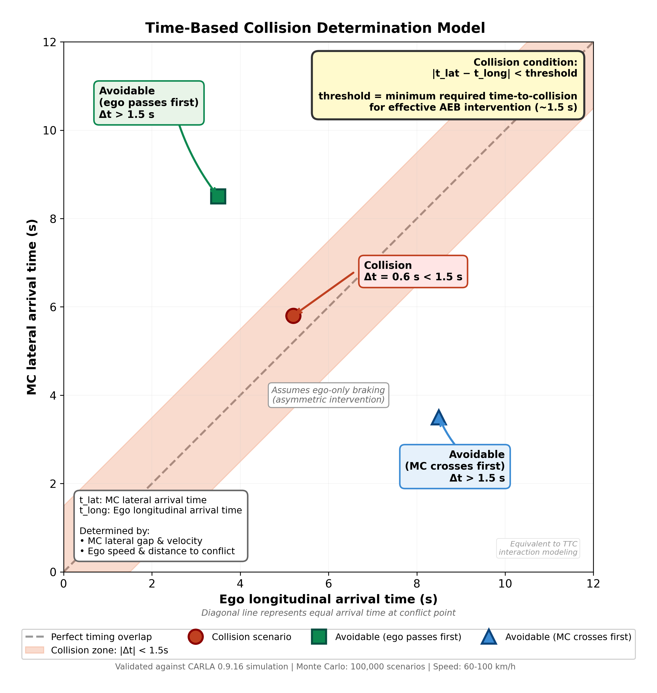
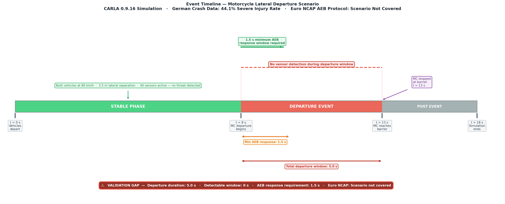
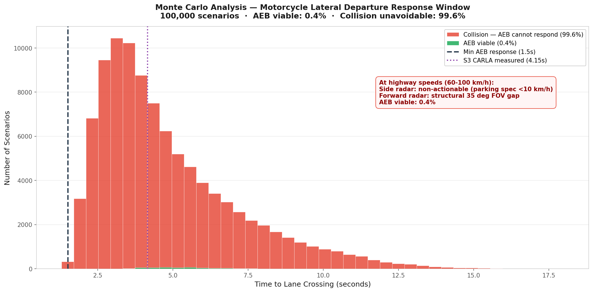
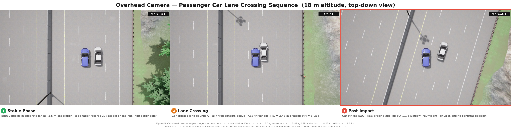
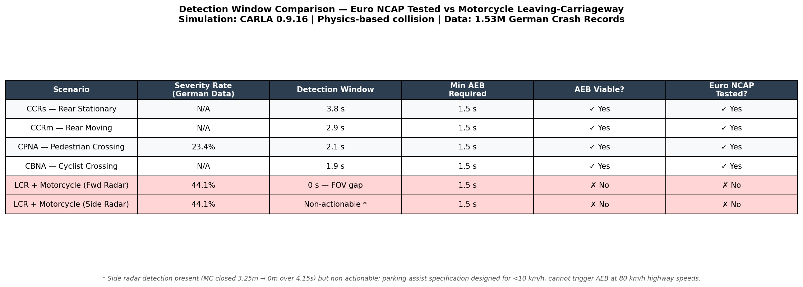
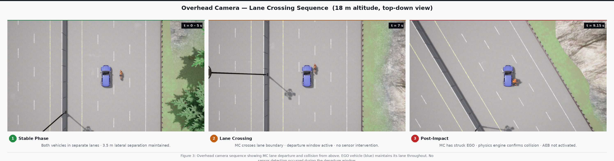

<div align="center">

# 🛡️ AEB Blind Side Study
## *Your car didn't see that coming*

**A physics simulation and statistical study of lateral intrusion detection gaps**
**in production ADAS sensor architectures at highway speeds**

<br>

[](https://carla.org)
[](https://python.org)
[]()
[]()
[]()
[](https://zenodo.org)
[](LICENSE)

<br>

*Phase 2 of the [ADAS Validation Gap Research Series](https://github.com/TejasManjunath/adas-validation-gap-analysis)*

<br>

[**Overview**](#-overview) · [**Research Journey**](#-the-research-journey) · [**Key Findings**](#-key-findings) · [**Methodology**](#-methodology) · [**Results**](#-results) · [**Validation**](#-target-independence-validation) · [**How to Run**](#-how-to-run) · [**Citation**](#-citation) · [**About**](#-about-this-work)

---

</div>

<!-- ─────────────────────────────────────────────────────────────────────────
     IMAGE 1 · figures/hero_figure_RIGHT.png
     Four-panel: A=CARLA reality · B=sensor architecture · C=99.6% stat · D=counterfactual bars
     Full width · first thing visitor sees
     ───────────────────────────────────────────────────────────────────────── -->
<div align="center">
  
  <br><br>
  <sub><i>From left: CARLA simulation confirms MC is visible but undetected → sensor architecture explains why → Monte Carlo quantifies 99.6% failure rate → counterfactual maps the solution space</i></sub>
</div>

<br>

---

## ⚡ At a Glance

<div align="center">

<table>
<tr>
<td align="center" width="200"><h2>99.6%</h2><sub>Baseline collision rate<br>100,000 scenarios</sub></td>
<td align="center" width="200"><h2>t = 5.01 s</h2><sub>All sensors detect<br>0.01 s after departure</sub></td>
<td align="center" width="200"><h2>t = 8.05 s</h2><sub>AEB activates<br>TTC = 3.43 s threshold</sub></td>
<td align="center" width="200"><h2>1.1 s</h2><sub>Reaction window left<br>Insufficient at 80 km/h</sub></td>
</tr>
<tr>
<td align="center"><h3>−22.1 pp</h3><sub>Corner radar improvement<br>99.6% → 77.4%</sub></td>
<td align="center"><h3>46.6%</h3><sub>Physics-limited floor<br>Unavoidable even with<br>perfect detection</sub></td>
<td align="center"><h3>44.1%</h3><sub>Real-world severe injury<br>1.53M German records<br>2.37× national baseline</sub></td>
<td align="center"><h3>Not Covered</h3><sub>Euro NCAP AEB<br>protocol status<br>for this scenario</sub></td>
</tr>
</table>

</div>

---

## 📌 Overview

Modern **AEB systems** are designed and certified for **longitudinal threats** — vehicles braking ahead of you. Euro NCAP tests rear stationary, rear moving, pedestrian, and cyclist scenarios. Every single one is from the front. In a straight line.

**None test a vehicle hitting you from the side.**

This study asks one question:

> *If a motorcycle loses control and crosses into your lane laterally at highway speed — can current production AEB detect and respond in time?*

No manufacturer demonstrates this scenario. No Euro NCAP protocol tests it. This study builds the physics simulation, runs 100,000 randomised scenarios, and finds the answer is **no** — at two independent architectural levels.

---

## 🔗 The Research Journey

This is not a standalone simulation. It is the direct continuation of a question that started with 1.53 million crash records.

<br>

<div align="center">

```
╔══════════════════════════════════════════════════════════════════════╗
║  PHASE 1 — adas-validation-gap-analysis                              ║
║  github.com/TejasManjunath/adas-validation-gap-analysis              ║
╠══════════════════════════════════════════════════════════════════════╣
║                                                                      ║
║  Data:    1,539,249 German crash records, 2019–2024                  ║
║           (2019 = pre-COVID baseline · 2020 = pandemic traffic       ║
║            reduction captured · 2024 = last full year available)     ║
║                                                                      ║
║  Method:  Logistic regression severity model + SRPI ranking          ║
║           Cross-referenced against Euro NCAP AEB protocol documents  ║
║                                                                      ║
║  Finding: Motorcycle leaving-carriageway = 44.1% severe injury rate  ║
║           2.37× the national baseline of 18.56%                     ║
║           Zero coverage in any Euro NCAP AEB test protocol           ║
║                                                                      ║
╚══════════════════════════════════════════════════════════════════════╝
                               │
                               │  The gap is proven in crash data.
                               │  But can current hardware handle it?
                               │
                               ▼
╔══════════════════════════════════════════════════════════════════════╗
║  PHASE 2 — aeb-blind-side-study  (THIS REPOSITORY)                  ║
╠══════════════════════════════════════════════════════════════════════╣
║                                                                      ║
║  Tool:    CARLA 0.9.16 physics simulation                            ║
║  Scale:   100,000 Monte Carlo scenarios · multi-seed validated       ║
║                                                                      ║
║  Finding: Detection occurs at t = 5.01 s — 0.01 s after departure.  ║
║           The system sees it. Then waits 3 more seconds.             ║
║           AEB activates at t = 8.05 s — 1.1 s remains.              ║
║           Not missing hardware. Architectural mismatch.              ║
║                                                                      ║
╚══════════════════════════════════════════════════════════════════════╝
```

</div>

<br>

**Phase 1** proved the gap is real using crash statistics.
**Phase 2** proves the gap is structural using physics simulation.
Together: a complete evidence chain from injury data to root cause.

---

## 🎯 Key Findings

### Real-World Stakes

<!-- ─────────────────────────────────────────────────────────────────────
     IMAGE 2 · figures/08_validation_story_visual.png
     Bar chart from Phase 1 — crash severity vs Euro NCAP coverage
     Red = not covered · Orange = partial · Green = covered
     Baseline marker at 18.56%
     ───────────────────────────────────────────────────────────────────── -->
<div align="center">
  
  <br>
  <sub><b>Figure 1</b> — Phase 1 finding from 1.53M German crash records: motorcycle leaving-carriageway scenarios show 44.1% severe injury rate — 2.37× the national baseline. Zero Euro NCAP AEB coverage. This is the gap Phase 2 investigates.</sub>
</div>

<br>

### The Direct Proof

<!-- ─────────────────────────────────────────────────────────────────────
     IMAGE 3 · figures/figB_sensor_gap_proof.png
     Right-side ego camera at t=5.0s
     MC clearly visible · sensor status: NO DETECTION / NON-ACTIONABLE / NO DETECTION
     Red box: "NOT detected by AEB sensors"
     Green box: "Motorcycle visible to human eye"
     ───────────────────────────────────────────────────────────────────── -->
<div align="center">
  
  <br>
  <sub><b>Figure 2</b> — At t = 5.0 s: motorcycle clearly visible at 3.5 m lateral separation. Forward radar (35°): NO DETECTION — structural FOV gap. Side radar (8 m): NON-ACTIONABLE — parking-assist spec (<10 km/h). Rear radar: NO DETECTION — geometry gap. AEB has no trigger pathway.</sub>
</div>

<br>

### The Architecture Gap — and the Fix

<!-- ─────────────────────────────────────────────────────────────────────
     IMAGE 4 · figures/sensor_architecture_RIGHT.png
     Left (current): 35° cone, MC outside, "No intervention possible"
     Right (corner radar): 120° FOV zones from front corners, MC inside, "Early detection possible"
     ───────────────────────────────────────────────────────────────────── -->
<div align="center">
  
  <br>
  <sub><b>Figure 3</b> — Left: current production architecture — 35° forward FOV blind zone, parking-spec side radar. Right: corner radar enhancement (120° FOV, 50 m) restores lateral coverage. Collision rate: 99.6% → 77.4% (−22.1 pp).</sub>
</div>

<br>

### The Headline Number

<!-- ─────────────────────────────────────────────────────────────────────
     IMAGE 5 · figures/mc_headline.png
     Large bold 99.6% on white background
     Below: MC parameters, sensor failure summary, validation footer
     ───────────────────────────────────────────────────────────────────── -->
<div align="center">
  
</div>

---

## 🔬 The Two-Layer Failure

Two independent architectural failures combine. Fixing one alone is not enough.

```
━━━━━━━━━━━━━━━━━━━━━━━━━━━━━━━━━━━━━━━━━━━━━━━━━━━━━━━━━━━━━━━━━
 LAYER 1 — SENSOR ARCHITECTURE  (why the system cannot act in time)
━━━━━━━━━━━━━━━━━━━━━━━━━━━━━━━━━━━━━━━━━━━━━━━━━━━━━━━━━━━━━━━━━

  Forward radar   35° FOV — MC is geometrically always outside
  Side radar      8 m, <10 km/h spec — non-actionable at highway speed
  Rear radar      MC approaches laterally — first hit at t = 13.3 s

━━━━━━━━━━━━━━━━━━━━━━━━━━━━━━━━━━━━━━━━━━━━━━━━━━━━━━━━━━━━━━━━━
 LAYER 2 — DECISION ARCHITECTURE  (why detection alone is not enough)
━━━━━━━━━━━━━━━━━━━━━━━━━━━━━━━━━━━━━━━━━━━━━━━━━━━━━━━━━━━━━━━━━

  t = 5.01 s   All sensors detect — 0.01 s after departure
               The system is not blind. Detection is not the failure.

  t = 5–8 s    TTC threshold not crossed — AEB waits
               TTC-based logic built for longitudinal threats
               Lateral closing at 0.7 m/s drops TTC slowly

  t = 8.05 s   AEB activates — TTC = 3.43 s threshold finally met
  t = 9.15 s   Collision — only 1.1 s was available

━━━━━━━━━━━━━━━━━━━━━━━━━━━━━━━━━━━━━━━━━━━━━━━━━━━━━━━━━━━━━━━━━
 CONCLUSION: Not missing hardware. A specification mismatch and a
             decision architecture built for the wrong threat geometry.
━━━━━━━━━━━━━━━━━━━━━━━━━━━━━━━━━━━━━━━━━━━━━━━━━━━━━━━━━━━━━━━━━
```

---

## 🏗️ Repository Structure

```
aeb-blind-side-study/
│
├── 📄 README.md
├── 📄 LICENSE
├── 📄 requirements.txt
├── 📄 .gitignore
│
├── 📁 simulation/
│   ├── s3_ego_mc.py          ← CARLA S1: EGO + Motorcycle (Kawasaki Ninja)
│   ├── s3_ego_car.py         ← CARLA S2: EGO + Passenger Car (Toyota Prius)
│   └── s4_analysis.py        ← Detection window figures vs Euro NCAP
│
├── 📁 analysis/
│   └── monte_carlo_final.py  ← Complete MC: baseline + CF + actuation sweep
│
├── 📁 figures/               ← All 23 publication figures
│   ├── hero_figure_RIGHT.png
│   ├── mc_headline.png
│   ├── 08_validation_story_visual.png
│   ├── figA_simulation_storyboard.png
│   ├── figB_sensor_gap_proof.png
│   ├── figC_overhead_sequence.png
│   ├── figD_car_storyboard.png
│   ├── figE_car_overhead.png
│   ├── figF_mc_vs_car_comparison.png
│   ├── figG_aeb_timeline.png
│   ├── sensor_architecture_RIGHT.png
│   ├── sensor_coverage_diagram.png
│   ├── annotated_scenario_forensic.png
│   ├── time_interaction_model_FINAL.png
│   ├── event_timeline__2_.png
│   ├── detection_window_chart.png
│   ├── detection_window_table.png
│   ├── failure_attribution.png
│   ├── cf_comparison.png
│   ├── mc_distribution.png
│   ├── mc_heatmap.png
│   ├── actuation_heatmap.png
│   └── impact_severity.png
│
├── 📁 frames/
│   ├── mc/                   ← Selected CARLA frames — MC scenario
│   └── car/                  ← Selected CARLA frames — Car scenario
│
└── 📁 data/
    ├── sensor_logs/
    │   ├── mc_sensor_log.txt
    │   ├── car_sensor_log.txt
    │   ├── mc_sensor_raw.txt
    │   └── car_sensor_raw.txt
    └── outputs/
        ├── mc_results.csv
        ├── mc_tick_data.csv
        ├── cf_summary.csv
        └── actuation_sweep.csv
```

---

## 🧪 Methodology

### Simulation Setup

The scenario replicates the crash topology found in Phase 1: a motorcycle departing laterally into an adjacent lane at motorway speed. Straight highway geometry was chosen deliberately to isolate sensor and decision architecture performance without curve confounds.

<div align="center">

| Parameter | Value | Rationale |
|:---|:---:|:---|
| Simulator | CARLA 0.9.16 | Physics-validated, industry-standard |
| Map | Town04 — straight highway | Eliminates curve geometry confounds |
| Ego vehicle | BMW Grand Tourer | Representative mid-size passenger car |
| Threat S1 | Kawasaki Ninja | Phase 1 SRPI top-ranked scenario |
| Threat S2 | Toyota Prius | Target-independence validation |
| Speed — both | 80 km/h constant | Motorway speed at crash conditions |
| Lane gap | 3.50 m | Measured from Town04 road geometry |
| Lateral drift | 0.7 m/s | Representative departure rate |
| Collision window | **4.15 s** (CARLA physics) | vs 5.0 s mathematical prediction |
| Correction factor | **0.83** | 4.15 / 5.0 — applied globally |

</div>

<!-- ─────────────────────────────────────────────────────────────────────
     IMAGE 6 · figures/figA_simulation_storyboard.png
     Three-panel chase camera: Stable (green) → Departure (orange) → Collision (red border)
     ───────────────────────────────────────────────────────────────────── -->
<div align="center">
  
  <br>
  <sub><b>Figure 4</b> — Chase camera: stable travel t = 0–5 s (zero AEB trigger) → lateral departure t = 5–9 s (zero actionable detection) → unavoidable collision at t = 9.15 s. AEB was never activated.</sub>
</div>

<br>

### Sensor Configuration

<div align="center">

| Sensor | H-FOV | Range | Production Spec | Finding |
|:---|:---:|:---:|:---|:---|
| Forward radar | 35° | 150 m | Standard AEB | **FOV gap** — lateral targets always outside cone |
| Side radar | 120° | 8 m | Parking assist | **Non-actionable** — <10 km/h design threshold |
| Rear radar | 150° | 80 m | Blind spot | **Geometry gap** — first valid hit at t = 13.3 s |
| Corner radar | 120° | 50 m | *Counterfactual* | Restores coverage — −22.1 pp improvement |

</div>

<!-- ─────────────────────────────────────────────────────────────────────
     IMAGE 7 · figures/sensor_coverage_diagram.png
     Two overhead plots: stable phase (left) vs departure phase (right)
     All four radar zones plotted · MC outside all actionable ranges
     Red banner: "Departure: 5.0s · Detectable: 0s · AEB required: 1.5s"
     ───────────────────────────────────────────────────────────────────── -->
<div align="center">
  
  <br>
  <sub><b>Figure 5</b> — Radar coverage across stable phase (left) and departure phase (right). All four modalities fail during the 5.0 s departure window. Zero seconds detectable vs 1.5 seconds required minimum.</sub>
</div>

<br>

<!-- ─────────────────────────────────────────────────────────────────────
     IMAGE 8 · figures/time_interaction_model_FINAL.png
     2D scatter: collision zone |t_lat - t_long| < 1.5s
     Red dot = CARLA S3 result · Green/blue = avoidable zones
     ───────────────────────────────────────────────────────────────────── -->
<div align="center">
  
  <br>
  <sub><b>Figure 6</b> — Time-based collision model: collision when |t_lat − t_long| < 1.5 s. Red dot = CARLA S3 baseline (Δt = 0.6 s — confirmed collision). Validated against all 100,000 Monte Carlo scenarios.</sub>
</div>

<br>

<!-- ─────────────────────────────────────────────────────────────────────
     IMAGE 9 · figures/event_timeline__2_.png
     Horizontal timeline 0–18s: Stable / Departure / Post-Event phases
     Red dashed box: "No sensor detection during departure window"
     Warning box: "Detectable: 0s · AEB required: 1.5s · Euro NCAP: Not covered"
     ───────────────────────────────────────────────────────────────────── -->
<div align="center">
  
  <br>
  <sub><b>Figure 7</b> — Event timeline: 5.0 s departure window with zero actionable detection. The protocol gap (Phase 1) and the physics gap (Phase 2) are the same gap seen from two angles.</sub>
</div>

<br>

<!-- ─────────────────────────────────────────────────────────────────────
     IMAGE 10 · figures/annotated_scenario_forensic.png
     Top-down annotated diagram: EGO, MC departure path
     35° forward cone · MC outside · "No AEB trigger"
     Side radar non-actionable annotation
     ───────────────────────────────────────────────────────────────────── -->
<div align="center">
  
  <br>
  <sub><b>Figure 8</b> — Departure trajectory outside the 35° forward FOV. Side radar non-actionable above 10 km/h. No AEB trigger pathway exists in current production architecture.</sub>
</div>

<br>

### Monte Carlo Design

Developed progressively — 1,000 scenarios to validate the model, 10,000 for consistency, then 100,000 with full counterfactual configurations, sensitivity analysis, and actuation sweep. Multi-seed validation confirms result stability.

<div align="center">

| Parameter | Distribution | Range | Noise | Note |
|:---|:---|:---:|:---:|:---|
| Speed | Stratified (60% highway) | 60–100 km/h | — | Reflects real traffic mix |
| Lateral drift | Uniform | 0.3–1.2 m/s | ±10% | Departure variability |
| Lane gap | Uniform | 2.5–5.0 m | ±5% | EU highway widths |
| Long. offset | Uniform | ±10 m | — | True lateral geometry |
| Seeds | — | 42, 123, 999 | — | Std = **0.020%** |

</div>

> **On the ±10 m offset:** Wider ranges (−30 to +50 m) include cut-in scenarios that inflate AEB viability. Excluded by design. This study models pure lateral departure geometry only.

---

## 📊 Results

### Detection Window

<!-- ─────────────────────────────────────────────────────────────────────
     IMAGE 11 · figures/detection_window_chart.png
     Bar chart: Euro NCAP tested (green, 1.9–3.8s) vs MC lateral (red, 0s)
     Dashed line: Min AEB response 1.5s · "NOT IN EURO NCAP" labels
     ───────────────────────────────────────────────────────────────────── -->
<div align="center">
  
  <br>
  <sub><b>Figure 9</b> — Euro NCAP scenarios: 1.9–3.8 s detection windows, all viable. MC lateral intrusion: zero actionable window. Both radar modalities fail simultaneously. The Phase 1 protocol gap is confirmed as a Phase 2 physics gap.</sub>
</div>

<br>

### Failure Attribution

<!-- ─────────────────────────────────────────────────────────────────────
     IMAGE 12 · figures/failure_attribution.png
     Left: pie chart — 53.2% detection-limited / 46.8% physics-limited
     Right: horizontal bars — Baseline 99.6% → Improved → Corner → Perfect 46.6%
     ───────────────────────────────────────────────────────────────────── -->
<div align="center">
  
  <br>
  <sub><b>Figure 10</b> — 53.2% of failures are detection-limited (sensor architecture — addressable). 46.8% are physics-limited (unavoidable even with perfect detection). Right: counterfactual upgrade pathway shows corner radar delivers the largest improvement at −22.1 pp.</sub>
</div>

<br>

### Monte Carlo Distribution

<!-- ─────────────────────────────────────────────────────────────────────
     IMAGE 13 · figures/mc_distribution.png
     Histogram: red (collision 99.6%) vs green (viable 0.4%)
     Dashed: Min AEB 1.5s · Dotted: S3 CARLA 4.15s
     Annotation inside sparse right tail area
     ───────────────────────────────────────────────────────────────────── -->
<div align="center">
  
  <br>
  <sub><b>Figure 11</b> — 99.6% of scenarios fall in the collision zone. The 0.4% AEB-viable window exists only at extreme slow-drift / large-gap parameters — unrealistic for real highway departures.</sub>
</div>

<br>

<!-- ─────────────────────────────────────────────────────────────────────
     IMAGE 14 · figures/mc_heatmap.png
     Scatter: drift × gap space · red = collision · green = viable
     Purple star = S3 CARLA baseline (0.7 m/s, 3.5m) · diagonal boundary line
     ───────────────────────────────────────────────────────────────────── -->
<div align="center">
  
  <br>
  <sub><b>Figure 12</b> — Every scenario in drift × gap space. Realistic highway parameters (0.7–1.2 m/s, 3–5 m) fall entirely in the collision zone. Star = S3 CARLA baseline. AEB-viable scenarios exist only at the slow-drift boundary.</sub>
</div>

<br>

### Impact Severity

<!-- ─────────────────────────────────────────────────────────────────────
     IMAGE 15 · figures/impact_severity.png
     Histogram: high (>20 m/s, dark red) / medium / low severity zones
     Mean impact line: 22.77 m/s (82 km/h)
     ───────────────────────────────────────────────────────────────────── -->
<div align="center">
  
  <br>
  <sub><b>Figure 13</b> — Mean impact: 22.77 m/s (82 km/h) — near full-speed in almost every scenario. This directly explains the 44.1% severe injury rate found in Phase 1: no AEB intervention means no speed reduction at impact.</sub>
</div>

<br>

### Actuation Sweep — Physics Floor

<!-- ─────────────────────────────────────────────────────────────────────
     IMAGE 16 · figures/actuation_heatmap.png
     3×4 heatmap: reaction time (0.5–1.2s) × deceleration (8–10 m/s²)
     All cells dark green: 16.5% to 46.5% — confirms physics floor
     ───────────────────────────────────────────────────────────────────── -->
<div align="center">
  
  <br>
  <sub><b>Figure 14</b> — Under perfect detection, best-case actuation (0.5 s, 10 m/s²) achieves 16.5%. The 46.6% physics floor confirms lateral kinematics at 80 km/h make a significant proportion of scenarios unavoidable regardless of sensor or decision architecture improvements.</sub>
</div>

<br>

### Counterfactual Summary

<div align="center">

| Configuration | Collision Rate | vs Baseline | What Changes |
|:---|:---:|:---:|:---|
| Baseline — current production | 99.6% | — | Side <10 km/h · fwd 35° FOV gap |
| Improved — highway-rated radar | 97.4% | −2.2 pp | Side radar threshold raised |
| Corner radar — 120° / 50 m | **77.4%** | **−22.1 pp** | Front-corner sensors added |
| Perfect detection — physics floor | 46.6% | −52.9 pp | Detection always fires |

</div>

<!-- ─────────────────────────────────────────────────────────────────────
     IMAGE 17 · figures/cf_comparison.png
     Four vertical bars: Baseline / Improved / Corner / Perfect
     Dashed reference line at baseline · summary box top right
     ───────────────────────────────────────────────────────────────────── -->
<div align="center">
  
  <br>
  <sub><b>Figure 15</b> — Corner radar delivers 10× larger improvement than upgraded side radar alone (−22.1 pp vs −2.2 pp). The 46.6% physics floor confirms perfect detection cannot eliminate all scenarios given lateral kinematics at highway speed.</sub>
</div>

---

## 🔁 Target-Independence Validation

The passenger car scenario was added specifically to test whether the failure was radar cross-section dependent. A motorcycle (RCS ~1–3 m²) is far harder to detect than a car (~10–20 m²). If RCS were the cause, a larger target should produce a better outcome.

It does not.

<!-- ─────────────────────────────────────────────────────────────────────
     IMAGE 18 · figures/figF_mc_vs_car_comparison.png
     Two-row comparison: MC (S1) and Car (S2) — three panels each + metrics table
     Key metrics: detection t=5.01s · AEB t=8.05s · collision t=9.15s (both identical)
     Red "KEY FINDING" box
     ───────────────────────────────────────────────────────────────────── -->
<div align="center">
  
  <br>
  <sub><b>Figure 16</b> — Identical parameters, two vehicle types. Both: detection t = 5.01 s · AEB t = 8.05 s · collision t = 9.15 s. Radar cross-section is not the cause. The failure is architectural — sensor specification and decision logic — confirmed target-independent.</sub>
</div>

<br>

<!-- ─────────────────────────────────────────────────────────────────────
     IMAGE 19 · figures/figG_aeb_timeline.png
     Horizontal timeline: both scenarios overlaid
     Phase bands: Stable / Departure / AEB Active / Post-Impact
     Boxed labels with connecting lines · 1.1s bracket bottom
     S1 = S2 equivalence statement
     ───────────────────────────────────────────────────────────────────── -->
<div align="center">
  
  <br>
  <sub><b>Figure 17</b> — Both scenarios: detection t = 5.01 s · AEB t = 8.05 s · collision t = 9.15 s. The 1.1 s window is physically insufficient at 80 km/h regardless of target vehicle type.</sub>
</div>

<br>

<!-- ─────────────────────────────────────────────────────────────────────
     IMAGE 20 · figures/figD_car_storyboard.png
     Three-panel chase camera: Car scenario
     Sensor depths in footer: fwd 14.6m · side 2.6m · rear 10.0m
     ───────────────────────────────────────────────────────────────────── -->
<div align="center">
  
  <br>
  <sub><b>Figure 18</b> — Passenger car: detection t = 5.01 s (fwd 14.6 m · side 2.6 m · rear 10.0 m) · AEB t = 8.05 s · collision t = 9.15 s. Identical to the motorcycle scenario in every critical metric.</sub>
</div>

<br>

<!-- ─────────────────────────────────────────────────────────────────────
     IMAGE 21 · figures/figE_car_overhead.png
     Three-panel overhead 18m: Car scenario
     Side radar: 297 stable-phase hits · continuous departure detection
     ───────────────────────────────────────────────────────────────────── -->
<div align="center">
  
  <br>
  <sub><b>Figure 19</b> — Overhead view confirms lane crossing. Side radar: 297 stable-phase hits then continuous departure detection. Detection was always present — the decision architecture makes collision unavoidable.</sub>
</div>

<br>

<details>
<summary><b>📎 Supplementary Figures</b></summary>

<br>

<!-- ─────────────────────────────────────────────────────────────────────
     IMAGE 22 · figures/detection_window_table.png
     Tabular: 6 scenarios × severity / window / AEB viable / NCAP covered
     Pink rows for MC scenarios
     ───────────────────────────────────────────────────────────────────── -->
<div align="center">
  
  <br>
  <sub><b>Figure 20</b> — MC lateral departures: 44.1% severe injury, 0s detection window, fail both AEB viability and Euro NCAP coverage simultaneously. Highest severity, zero protocol coverage.</sub>
</div>

<br>

<!-- ─────────────────────────────────────────────────────────────────────
     IMAGE 23 · figures/figC_overhead_sequence.png
     Three-panel overhead: MC scenario
     ───────────────────────────────────────────────────────────────────── -->
<div align="center">
  
  <br>
  <sub><b>Figure 21</b> — Overhead perspective on MC scenario. EGO maintains lane throughout — zero sensor intervention despite clearly visible lateral threat.</sub>
</div>

</details>

---

## ⚠️ Assumptions and Limitations

<div align="center">

| # | Assumption | Direction | Notes |
|:---:|:---|:---:|:---|
| 1 | Geometric FOV detection — no radar RCS modelled | Upper bound | Real MC detection would be harder (RCS ~1–3 m² vs car ~10–20 m²) |
| 2 | Single speed in CARLA (80 km/h) | Constrained | MC covers 60–100 km/h bands but no multi-speed physics runs |
| 3 | Uniform parameter distributions | Conservative | Standard in safety scenario analysis |
| 4 | Single correction factor (0.83) | Applied globally | Derived from one calibration point |
| 5 | Straight road only | Constrained | Isolates AEB braking cleanly — curves are future work |
| 6 | Constant lateral drift | Slightly conservative | Real loss-of-control may accelerate |
| 7 | No evasive steering | Constrained | Isolates braking intervention capability only |

</div>

---

## 🚀 How to Run

### Requirements

```bash
pip install -r requirements.txt
```

> CARLA 0.9.16 server must be running on `localhost:2000`
> See [CARLA quickstart](https://carla.readthedocs.io/en/0.9.16/start_quickstart/)

<br>

### CARLA Simulation

```bash
# Scenario S1 — Motorcycle lateral departure
python simulation/s3_ego_mc.py

# Scenario S2 — Passenger car lateral departure
python simulation/s3_ego_car.py
```

<details>
<summary>Output files per run</summary>

```
sensor_log.txt           — departure onset, AEB timing, collision event
sensor_raw.txt           — raw radar returns per sensor per tick
mc_baseline_metrics.csv  — kinematic calibration data for Monte Carlo
mc_tick_data.csv         — per-tick position, TTC, lateral separation
cam_chase_t*.png         — chase camera frames
cam_overhead_t*.png      — overhead frames at 18 m altitude
cam_side_t*.png          — right-side camera frames
```

</details>

<br>

### Monte Carlo Analysis

```bash
# Baseline + counterfactual + actuation sweep (~3–5 min)
python analysis/monte_carlo_final.py
```

Expected output — copy this to verify your run is correct:

```
── MULTI-SEED BASELINE VALIDATION ──
  Seed   42: 99.57%
  Seed  123: 99.59%
  Seed  999: 99.54%
  Mean: 99.57%   Std: 0.020%
  Target 99.6% ±0.5%: PASS ✓
```

<details>
<summary>Output files</summary>

```
cf_comparison.png        — four-bar architecture comparison
cf_summary.csv           — collision rates per configuration
actuation_heatmap.png    — reaction time × deceleration sweep
actuation_sweep.csv      — raw sweep data
mc_headline.png          — 99.6% headline statistic
mc_distribution.png      — crossing time histogram
mc_heatmap.png           — drift × gap parameter space
failure_attribution.png  — pie + bar failure attribution
impact_severity.png      — impact speed distribution
```

</details>

<br>

### Detection Window Analysis

```bash
python simulation/s4_analysis.py
```

---

## 📚 Citation

```bibtex
@misc{manjunath2026aeb,
  author    = {Tejas Manjunath},
  title     = {AEB Blind Side Study: Lateral Intrusion ADAS Gap —
               Physics Simulation and Monte Carlo Analysis},
  year      = {2026},
  publisher = {GitHub},
  url       = {https://github.com/TejasManjunath/aeb-blind-side-study},
  doi       = {10.5281/zenodo.XXXXXXX},
  note      = {Phase 2 of the ADAS Validation Gap Research Series}
}
```

**Phase 1 (prerequisite reading):**

```bibtex
@misc{manjunath2026adas,
  author    = {Tejas Manjunath},
  title     = {ADAS Scenario Coverage Gap Analysis: Using 1.53M German
               Crash Records to Identify Euro NCAP AEB Validation Blind Spots},
  year      = {2026},
  publisher = {GitHub},
  url       = {https://github.com/TejasManjunath/adas-validation-gap-analysis}
}
```

### References

<!-- Complete before publishing
[1]  Smith, T.A. (2009). Multivariate Analysis of MAIDS Fatal Accidents.
     DRI-TR-08-11. Dynamic Research Inc. / ACEM, Brussels.
[2]  Euro NCAP (2023). AEB VRU Test Protocol v4.4.
     https://www.euroncap.com/en/for-industry/protocols/
[3]  Statistische Ämter des Bundes und der Länder.
     German Traffic Accident Database 2019–2024. statistikportal.de
[4]  ISO 21448:2022 — Safety of the Intended Functionality (SOTIF)
[5]  UNECE Regulation No. 152 — Automatic Emergency Braking Systems
[6]  [ADD remaining references from paper]
-->

---

## 👤 About This Work

This study began with a dataset question, not a simulation idea.

An analysis of 1.53 million German crash records — spanning 2019 (pre-COVID baseline) through 2024 (latest full year from the Statistikportal) — found motorcycle leaving-carriageway events producing severe injury rates 2.37× the national average. A Scenario Risk Priority Index (SRPI) ranked them first. Cross-referencing against Euro NCAP AEB documentation confirmed they were entirely absent from any published validation framework.

That raised the question that became this project: not whether the scenario was tested — it was not — but whether current production AEB hardware could actually handle it if it were. No manufacturer demonstrates this. No simulation paper had investigated it from the sensor architecture perspective.

CARLA was used to build the scenario iteratively. The initial finding was unexpected: the sensors detected the motorcycle 0.01 seconds after departure. The system was not blind. The failure was that the TTC-based AEB decision logic took 3 more seconds to reach its threshold — by which point only 1.1 seconds remained.

Further investigation confirmed why: modern production vehicles run long-range forward sensors continuously on highways, but lateral sensors switch to blind-spot detection mode — a resource decision that makes complete sense for normal driving and catastrophically fails for lateral intrusion events.

Monte Carlo analysis was built progressively from 1,000 to 100,000 scenarios. A passenger car scenario was added to test RCS dependency. It confirmed the failure is architectural. Both phases were built independently by **Tejas Manjunath** between late 2025 and 2026. One laptop. No funding. No institutional support.

If you work in automotive safety and this is useful — that is why it was made public. If you use it, cite it. If you want to discuss or challenge the methodology, reach out.

---

## ⚖️ License

Code: **MIT** — see [LICENSE](LICENSE)

Research content, figures, and methodology: **© 2026 Tejas Manjunath**

Attribution required for any use of figures or findings:
```
Tejas Manjunath (2026). AEB Blind Side Study — Lateral Intrusion ADAS Gap.
https://github.com/TejasManjunath/aeb-blind-side-study
```

---

<div align="center">

*Phase 2 of the [ADAS Validation Gap Research Series](https://github.com/TejasManjunath/adas-validation-gap-analysis)*

<br>

*Built with CARLA 0.9.16 · Python 3.10 · NumPy · Matplotlib · Pillow*

<br>

*⭐ If this work is useful, please star the repository*

<br>

`adas` · `aeb` · `autonomous-driving` · `carla-simulator` · `lateral-collision` · `motorcycle-safety`
`monte-carlo` · `sensor-architecture` · `safety-simulation` · `euro-ncap` · `sotif` · `adas-validation` ·
`data-science` · `data-analysis` · `data-engineering` · `machine-learning`

</div>
