<div align="center">

# 🛡️ AEB Blind Side Study
## *Your car didn't see that coming*

**A physics simulation and statistical study of lateral intrusion detection gaps**  
**in production ADAS sensor architectures at highway speeds**

<br>

[](https://carla.org)
[](https://python.org)
[]()
[]()
[]()
[](https://doi.org/10.5281/zenodo.20450358)
[](LICENSE)

<br>

*Phase 2 of the [ADAS Validation Gap Research Series](https://github.com/TejasManjunath/adas-validation-gap-analysis)*

<br>

[**Overview**](#-overview) · [**Research Journey**](#-the-research-journey) · [**Key Findings**](#-key-findings) · [**Methodology**](#-methodology) · [**Results**](#-results) · [**Robustness Validation**](#-robustness-validation) · [**How to Run**](#-how-to-run) · [**Citation**](#-citation) · [**About**](#-about-this-work)

</div>

---

| Motorcycle — Chase Camera | Motorcycle — Overhead View | Passenger Car — Chase Camera |
|:---:|:---:|:---:|
| 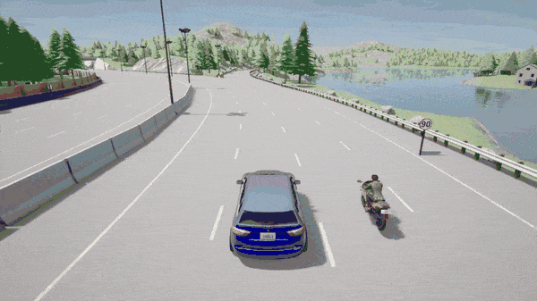 | 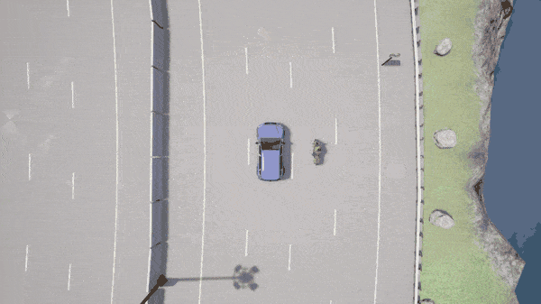 | 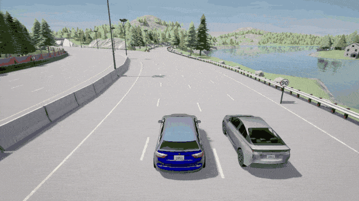 |

---

<div align="center">
  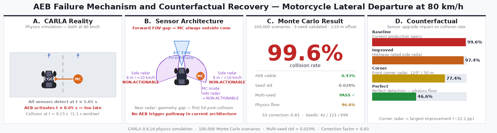
  <br><br>
  <sub><i>From left: CARLA simulation confirms MC is visible but undetected → sensor architecture explains why → Monte Carlo quantifies 99.6% failure rate → counterfactual maps the solution space</i></sub>
</div>

---

## ⚡ At a Glance

<div align="center">

<table>
<tr>
<td align="center" width="200"><h2>99.6%</h2><sub>Baseline collision rate<br>100,000 scenarios</sub></td>
<td align="center" width="200"><h2>t = 5.01 s</h2><sub>All sensors detect<br>0.01 s after departure</sub></td>
<td align="center" width="200"><h2>t = 8.05 s</h2><sub>AEB activates<br>TTC = 3.43 s threshold</sub></td>
<td align="center" width="200"><h2>1.1 s</h2><sub>Reaction window left<br>Insufficient at 80 km/h</sub></td>
</tr>
<tr>
<td align="center"><h3>−22.1 pp</h3><sub>Corner radar improvement<br>99.6% → 77.4%</sub></td>
<td align="center"><h3>46.6%</h3><sub>Physics-limited floor<br>Unavoidable even with<br>perfect detection</sub></td>
<td align="center"><h3>44.1%</h3><sub>Real-world severe injury<br>1.53M German records<br>2.37× national baseline</sub></td>
<td align="center"><h3>AEB Gap</h3><sub>Euro NCAP covers ELK<br>(departing vehicle only).<br>AEB for receiving vehicle:<br>no protocol exists.</sub></td>
</tr>
</table>

</div>

> **Euro NCAP update — October 2025:** The Lane Departure Collision Protocol v1.1 introduces Emergency Lane Keeping (ELK) assessment for Car-to-Motorcyclist scenarios — testing steering correction for the *departing* vehicle. It does not test AEB response for the *receiving* vehicle when a lateral intruder enters its path. The gap this study identifies remains unaddressed in active safety validation frameworks.

---

## 📌 Overview

Modern **AEB systems** are designed and certified for **longitudinal threats** — vehicles braking ahead of you. Euro NCAP tests rear stationary, rear moving, pedestrian, and cyclist scenarios. Every single one is from the front. In a straight line.

**None test whether the receiving vehicle's AEB can stop a lateral intruder.**

This study asks one question:

> *If a motorcycle loses control and crosses into your lane laterally at highway speed — can current production AEB detect and respond in time?*

No manufacturer demonstrates this scenario. No Euro NCAP AEB protocol tests it. This study builds the physics simulation, runs 100,000 randomised scenarios, and finds the answer is **no** — at two independent architectural levels.

---

## 🔗 The Research Journey

This is not a standalone simulation. It is the direct continuation of a question that started with 1.53 million crash records.

<div align="center">

```
╔══════════════════════════════════════════════════════════════════════╗
║  PHASE 1 — adas-validation-gap-analysis                              ║
║  github.com/TejasManjunath/adas-validation-gap-analysis              ║
╠══════════════════════════════════════════════════════════════════════╣
║                                                                      ║
║  Data:    1,539,249 German crash records, 2019–2024                  ║
║           Source: Unfallatlas — Statistische Ämter des Bundes        ║
║           und der Länder. Licence: Data Licence Germany v2.0         ║
║                                                                      ║
║  Method:  Logistic regression severity model + SRPI ranking          ║
║           Cross-referenced against Euro NCAP AEB protocol documents  ║
║                                                                      ║
║  Finding: Motorcycle leaving-carriageway = 44.1% severe injury rate  ║
║           2.37× the national baseline of 18.56%                     ║
║           Zero coverage in Euro NCAP AEB test protocols              ║
║                                                                      ║
╚══════════════════════════════════════════════════════════════════════╝
                               │
                               │  The gap is proven in crash data.
                               │  But can current hardware handle it?
                               │
                               ▼
╔══════════════════════════════════════════════════════════════════════╗
║  PHASE 2 — aeb-blind-side-study  (THIS REPOSITORY)                  ║
╠══════════════════════════════════════════════════════════════════════╣
║                                                                      ║
║  Tool:    CARLA 0.9.16 physics simulation                            ║
║  Scale:   100,000 Monte Carlo scenarios · multi-seed validated       ║
║                                                                      ║
║  Finding: Detection occurs at t = 5.01 s — 0.01 s after departure.  ║
║           The system sees it. Then waits 3 more seconds.             ║
║           AEB activates at t = 8.05 s — 1.1 s remains.              ║
║           Not missing hardware. Architectural mismatch.              ║
║                                                                      ║
╚══════════════════════════════════════════════════════════════════════╝
```

</div>

**Phase 1** proved the gap is real using crash statistics.  
**Phase 2** proves the gap is structural using physics simulation.  
Together: a complete evidence chain from injury data to root cause.

---

## 🎯 Key Findings

### Real-World Stakes

<div align="center">
  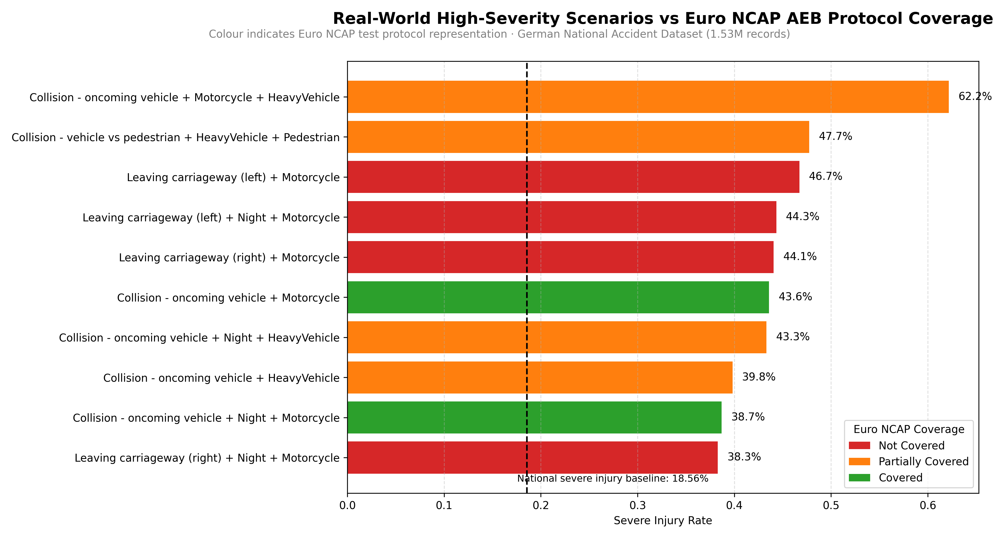
  <br>
  <sub><b>Figure 1</b> — Phase 1 finding from 1.53M German crash records: motorcycle leaving-carriageway scenarios show 44.1% severe injury rate — 2.37× the national baseline. Zero Euro NCAP AEB coverage. This is the gap Phase 2 investigates.</sub>
</div>

<br>

### The Direct Proof

<div align="center">
  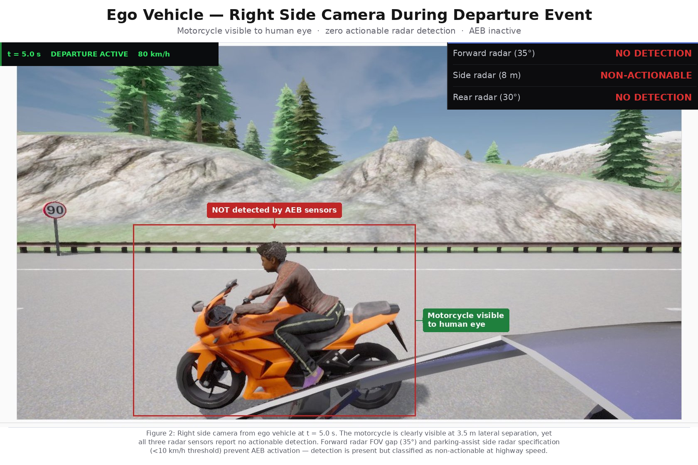
  <br>
  <sub><b>Figure 2</b> — At t = 5.0 s: motorcycle clearly visible at 3.5 m lateral separation. Forward radar (35°): NO DETECTION — structural FOV gap. Side radar (8 m): NON-ACTIONABLE — parking-assist spec (&lt;10 km/h). Rear radar: NO DETECTION — geometry gap. AEB has no trigger pathway.</sub>
</div>

<br>

### The Architecture Gap — and the Fix

<div align="center">
  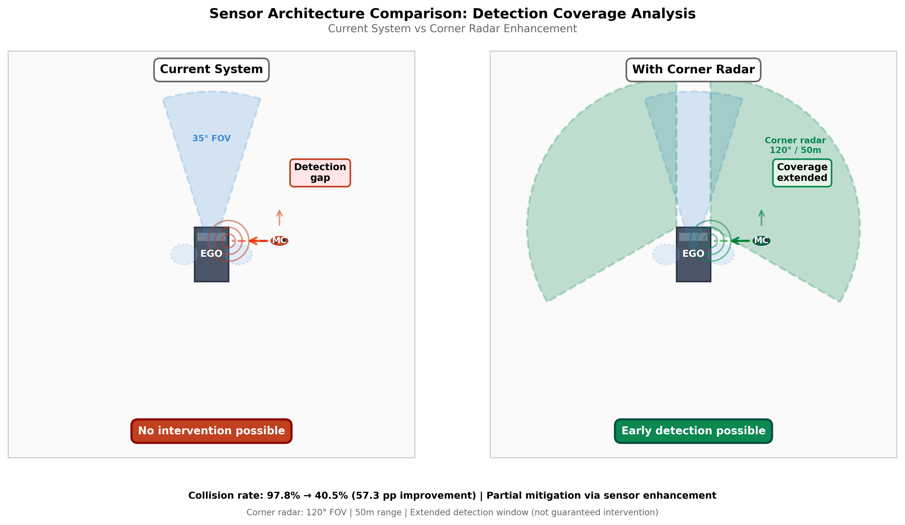
  <br>
  <sub><b>Figure 3</b> — Left: current production architecture — 35° forward FOV blind zone, parking-spec side radar. Right: corner radar enhancement (120° FOV, 50 m) restores lateral coverage. Collision rate: 99.6% → 77.4% (−22.1 pp).</sub>
</div>

<br>

### The Headline Number

<div align="center">
  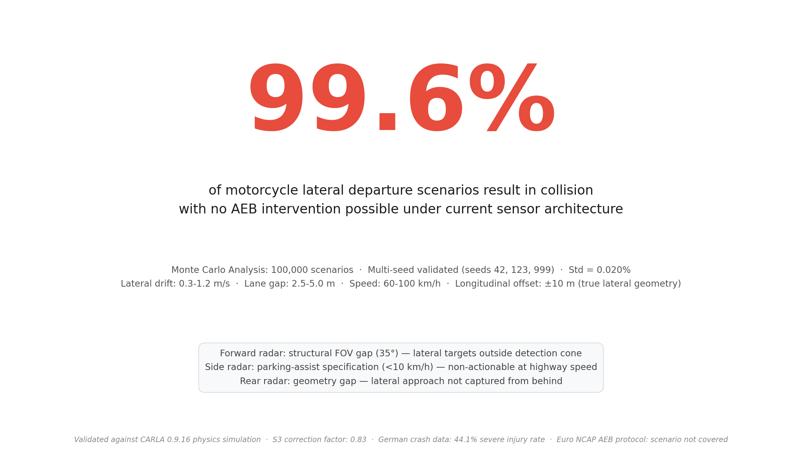
</div>

---

## 🔬 The Two-Layer Failure

Two independent architectural failures compound each other. Fixing one without the other produces minimal improvement — as the counterfactual results confirm.

```
━━━━━━━━━━━━━━━━━━━━━━━━━━━━━━━━━━━━━━━━━━━━━━━━━━━━━━━━━━━━━━━━━
 LAYER 1 — SENSOR ARCHITECTURE  (why the system cannot act in time)
━━━━━━━━━━━━━━━━━━━━━━━━━━━━━━━━━━━━━━━━━━━━━━━━━━━━━━━━━━━━━━━━━

  Forward radar   35° FOV — MC is geometrically always outside the cone
  Side radar      8 m, <10 km/h spec — non-actionable at highway speed
  Rear radar      MC approaches laterally — first valid hit at t = 13.3 s

━━━━━━━━━━━━━━━━━━━━━━━━━━━━━━━━━━━━━━━━━━━━━━━━━━━━━━━━━━━━━━━━━
 LAYER 2 — DECISION ARCHITECTURE  (why detection alone is not enough)
━━━━━━━━━━━━━━━━━━━━━━━━━━━━━━━━━━━━━━━━━━━━━━━━━━━━━━━━━━━━━━━━━

  t = 5.01 s   All sensors detect — 0.01 s after departure
               The system is not blind. Detection is not the failure.

  t = 5–8 s    TTC threshold not crossed — AEB waits
               TTC logic built for longitudinal threats
               Lateral closing at 0.70 m/s drops TTC 2.5× slower
               than a typical longitudinal approach at 80 km/h

  t = 8.05 s   AEB activates — TTC = 3.43 s threshold finally crossed
  t = 9.15 s   Collision — only 1.1 s was available

━━━━━━━━━━━━━━━━━━━━━━━━━━━━━━━━━━━━━━━━━━━━━━━━━━━━━━━━━━━━━━━━━
 CONCLUSION: Not missing hardware. A specification mismatch and a
             decision architecture calibrated for the wrong geometry.
━━━━━━━━━━━━━━━━━━━━━━━━━━━━━━━━━━━━━━━━━━━━━━━━━━━━━━━━━━━━━━━━━
```

---

## 🏗️ Repository Structure

```
aeb-blind-side-study/
│
├── 📄 README.md
├── 📄 LICENSE
├── 📄 requirements.txt
├── 📄 .gitignore
│
├── 📁 Simulation/
│   ├── s3_ego_mc.py            ← CARLA S1: EGO + Motorcycle (baseline)
│   ├── s3_ego_mc_v2.py         ← CARLA S1 v2: + CF sweep + TTC sweep modes
│   ├── s3_ego_car.py           ← CARLA S2: EGO + Passenger Car
│   └── s4_analysis.py          ← Detection window figures vs Euro NCAP
│
├── 📁 Analysis/
│   └── monte_carlo_final.py    ← MC: baseline + counterfactual + actuation sweep
│
├── 📁 figures/
│   ├── mc_incident.gif           ← MC lateral departure — chase camera
│   ├── mc_overhead.gif           ← MC lateral departure — overhead view
│   ├── car_incident.gif          ← Car lateral departure — chase camera
│   ├── hero_figure.png               ← Four-panel research summary
│   ├── 08_validation_story_visual.png← Phase 1 crash severity chart
│   ├── figA_simulation_storyboard.png
│   ├── figB_sensor_gap_proof.png
│   ├── figC_overhead_sequence.png
│   ├── figD_car_storyboard.png
│   ├── figE_car_overhead.png
│   ├── figF_mc_vs_car_comparison.png
│   ├── figG_aeb_timeline.png
│   ├── sensor_architecture_RIGHT.png
│   ├── sensor_coverage_diagram.png
│   ├── annotated_scenario_forensic.png
│   ├── time_interaction_model_FINAL.png
│   ├── event_timeline.png
│   ├── detection_window_chart.png
│   ├── detection_window_table.png
│   ├── failure_attribution.png
│   ├── cf_comparison.png
│   ├── mc_distribution.png
│   ├── mc_heatmap.png
│   ├── actuation_heatmap.png
│   ├── impact_severity.png
│   ├── mc_headline.png
│   ├── fig_s3_correction_derivation.png  ← S3 = (3.50−0.60)/3.50 derivation
│   ├── fig_cf_sweep_validation.png       ← CF validation: mean=0.833, σ=0.005
│   ├── fig_ttc_sweep_results.png         ← 8 TTC thresholds, all collision YES
│   ├── fig_multiseed_validation.png      ← Seeds 42/123/999, std=0.020%
│   └── fig_sensitivity_analysis.png      ← 3-panel sensitivity bars
│
├── 📁 frames/
│   ├── mc/                   ← CARLA frames — MC scenario
│   └── car/                  ← CARLA frames — Car scenario
│
└── 📁 data/
    ├── sensor_logs/
    │   ├── mc_sensor_log.txt
    │   ├── car_sensor_log.txt
    │   ├── mc_sensor_raw.txt
    │   └── car_sensor_raw.txt
    └── outputs/
        ├── mc_baseline_metrics.csv
        ├── mc_tick_data.csv
        ├── car_baseline_metrics.csv
        ├── car_tick_data.csv
        ├── cf_summary.csv
        ├── cf_sweep_results.csv
        ├── actuation_sweep.csv
        └── ttc_sweep_results.csv
```

---

## 🧪 Methodology

### Simulation Setup

The scenario replicates the crash topology identified in Phase 1: a vehicle departing laterally into an adjacent lane at highway speed. Town04's straight highway section was chosen deliberately to isolate sensor and decision architecture performance without curve geometry confounds.

<div align="center">

| Parameter | Value | Rationale |
|:---|:---:|:---|
| Simulator | CARLA 0.9.16 | Physics-validated, open-source ADAS platform |
| Map | Town04 — straight highway | Eliminates curve geometry as confounding variable |
| Ego vehicle | BMW Grand Tourer | Representative mid-size crossover |
| Threat S1 | Kawasaki Ninja | Phase 1 SRPI top-ranked scenario |
| Threat S2 | Toyota Prius | Target-type robustness validation |
| Speed — both | 80 km/h constant | Highway speed at departure conditions |
| Lane gap | 3.50 m | Measured from Town04 waypoint geometry |
| Lateral drift | 0.70 m/s | Representative loss-of-control departure rate |
| Correction factor | **0.83** | Kinematic threshold ratio — see derivation below |
| Collision window | **4.15 s** (CARLA) | vs 5.00 s mathematical prediction |
| OS / Python | Windows 11 / Python 3.10 | Ryzen 7, RTX 5060 Mobile, 32 GB RAM |

</div>

<div align="center">
  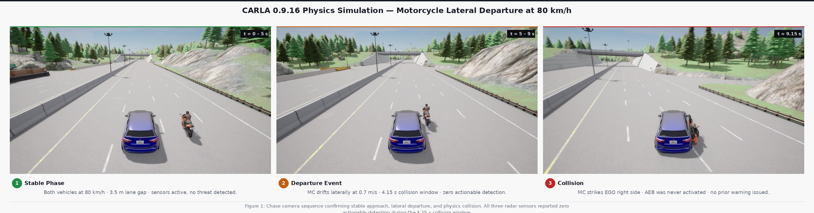
  <br>
  <sub><b>Figure 4</b> — Chase camera: stable travel t = 0–5 s → lateral departure t = 5–9 s (zero actionable detection) → unavoidable collision t = 9.15 s. AEB was never activated.</sub>
</div>

<br>

<div align="center">
  
  <br>
  <sub><b>Overhead view</b> — Motorcycle crossing lane markings laterally into ego vehicle path. The geometric blind zone of the 35° forward radar is clear from this perspective.</sub>
</div>

<br>

### Correction Factor Derivation

The analytical crossing-time model predicts `t_cross = 3.50 / 0.70 = 5.00 s`. CARLA physics measures 4.15 s. The discrepancy arises because CARLA's collision detection triggers at a finite lateral separation, not at zero.

The correction factor is not an empirical fit — it is a **kinematic threshold ratio** derived from first principles:

```
S3 = (LANE_GAP − IMPACT_THRESH) / LANE_GAP
   = (3.50 − 0.60) / 3.50
   = 0.83

Where:
  LANE_GAP     = 3.50 m  (Town04 measured)
  IMPACT_THRESH = 0.60 m  (motorcycle body half-width at physics handoff)
```

Applied globally: `time_to_cross = (gap / drift) × 0.83`

Validated across five drift speeds (0.3–1.2 m/s): **mean = 0.833, σ = 0.005, CV = 0.56%**. Drift-independent — confirming it is a geometric property, not a speed-dependent calibration.

<div align="center">
  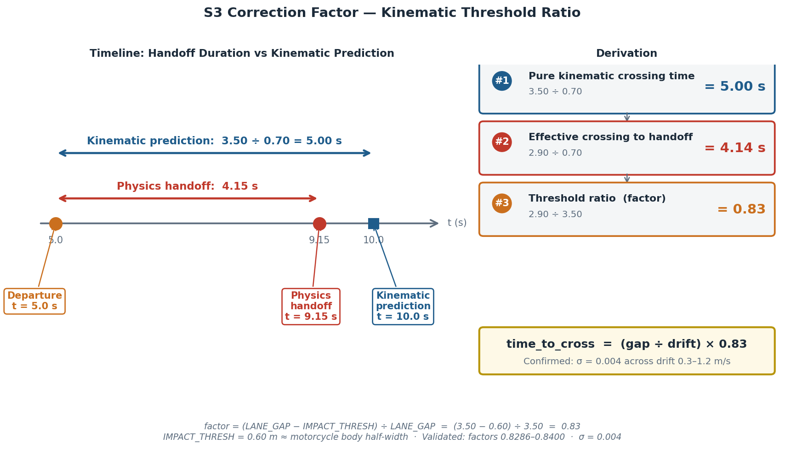
  <br>
  <sub><b>Figure 5</b> — Kinematic threshold ratio derivation: (3.50 m − 0.60 m) / 3.50 m = 0.83. IMPACT_THRESH = 0.60 m represents the lateral separation at which CARLA physics collision detection triggers.</sub>
</div>

<br>

### Sensor Configuration

<div align="center">

| Sensor | H-FOV | Range | Production Spec | Finding |
|:---|:---:|:---:|:---|:---|
| Forward radar | 35° | 150 m | Standard AEB LRR | **FOV gap** — lateral targets always outside cone |
| Side radar | 120° | 8 m | Parking-assist SRR | **Non-actionable** — &lt;10 km/h design threshold |
| Rear radar | 150° | 80 m | BSD / RCTA | **Geometry gap** — first valid hit at t = 13.3 s |
| Corner radar | 120° | 50 m | *Counterfactual only* | Restores coverage — −22.1 pp improvement |

</div>

> **Modelling constraint:** CARLA uses geometric ray-cast detection — no radar cross-section (RCS), multipath, or clutter simulation. This represents an **upper bound** on detection capability. Real motorcycle RCS (~1–3 m²) is significantly lower than cars (~10–20 m²), meaning real-world failure rates would be equal to or worse than the 99.6% baseline reported here.

<div align="center">
  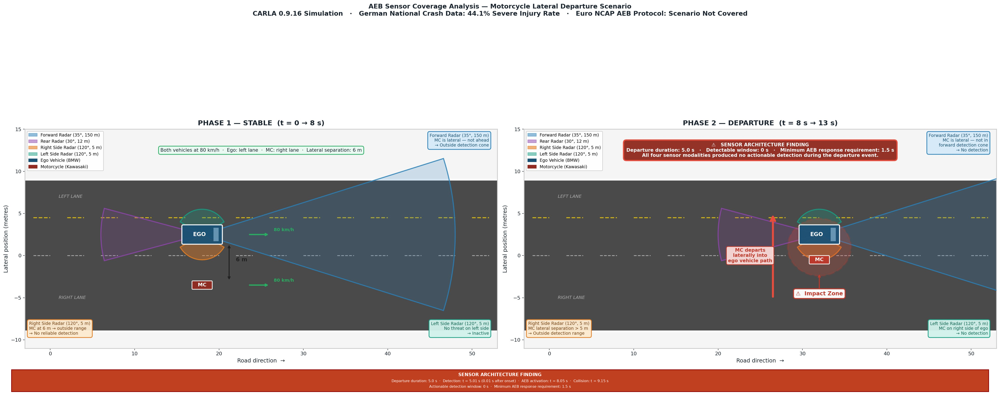
  <br>
  <sub><b>Figure 6</b> — Radar coverage during stable phase (left) and departure phase (right). All sensor modalities fail during the 5.0 s departure window. Zero seconds detectable vs 1.5 s minimum required for AEB intervention.</sub>
</div>

<br>

### Monte Carlo Framework

The Monte Carlo framework evaluates a **closed-form analytical collision model** calibrated from CARLA scenario observations — not 100,000 independent CARLA physics runs. This enables 3–5 minute execution on standard hardware while preserving physics fidelity.

Model equations:
```
t_cross   = (gap / drift) × 0.83
t_respond = reaction_time + (speed / deceleration)
collision = t_cross ≤ t_respond  OR  detection = False
```

<div align="center">

| Parameter | Distribution | Range | Note |
|:---|:---|:---:|:---|
| Speed | Stratified uniform | 60–100 km/h | 60% weight in 70–90 km/h highway band |
| Lateral drift | Uniform | 0.3–1.2 m/s | Gradual drift to rapid loss-of-control |
| Lane gap | Uniform | 2.5–5.0 m | European highway lane width variation |
| Longitudinal offset | Uniform | ±10 m | Pure lateral departure geometry (excludes cut-ins) |
| Seeds | — | 42, 123, 999 | Std = **0.020%** |

</div>

> **On the ±10 m offset:** Wider offset ranges (e.g. −30 to +50 m) introduce cut-in scenarios from trailing positions, artificially inflating AEB viability rates. The ±10 m range is constrained deliberately to model pure lateral departure geometry only.

---

## 📊 Results

### Detection Window

<div align="center">
  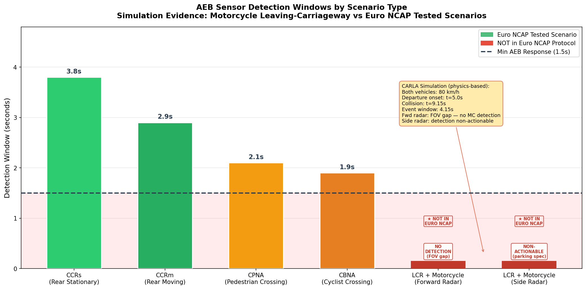
  <br>
  <sub><b>Figure 7</b> — Euro NCAP scenarios provide 1.9–3.8 s of actionable detection window. Lateral intrusion: zero actionable window. The Phase 1 protocol gap (no Euro NCAP coverage) is confirmed as a Phase 2 physics gap (zero AEB viability).</sub>
</div>

<br>

### Baseline Performance

Production sensor architecture produced collision outcomes in **99.57%** of 100,000 Monte Carlo scenarios (reported as 99.6%). Multi-seed validation confirms stability: seeds 42, 123, 999 yielded 99.57%, 99.59%, 99.54% (std = 0.020%).

<div align="center">
  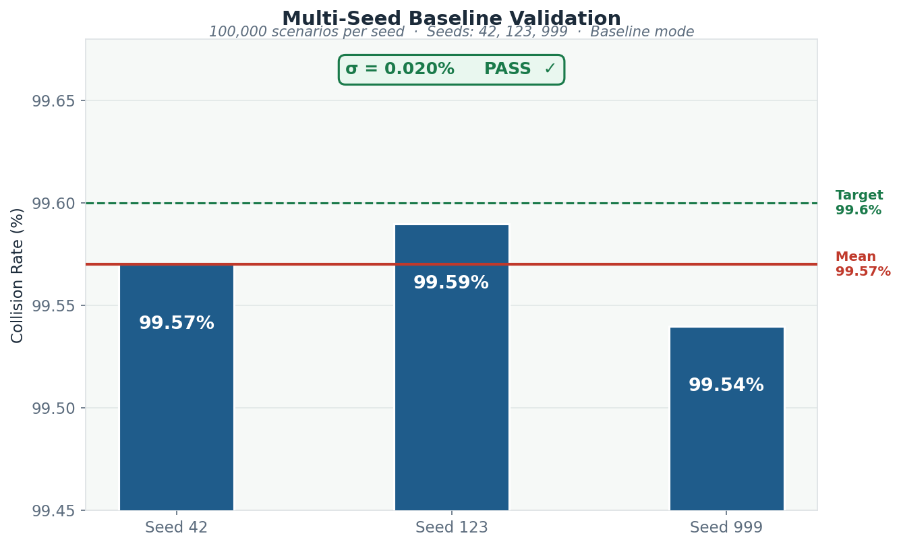
  <br>
  <sub><b>Figure 8</b> — Three independent random seeds produce collision rates within 0.05 pp of each other (std = 0.020%). The baseline finding is not seed-dependent.</sub>
</div>

<br>

<div align="center">
  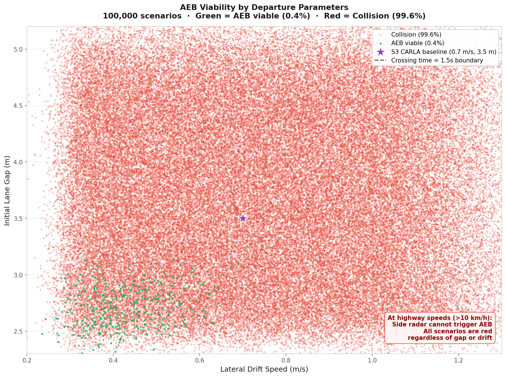
  <br>
  <sub><b>Figure 9</b> — Drift × gap parameter space: realistic highway conditions (0.7–1.2 m/s, 3–5 m) fall entirely in the collision zone. The 0.4% AEB-viable region exists only at extreme slow-drift and large-gap boundaries — outside realistic highway departure conditions.</sub>
</div>

<br>

### Failure Attribution

<div align="center">
  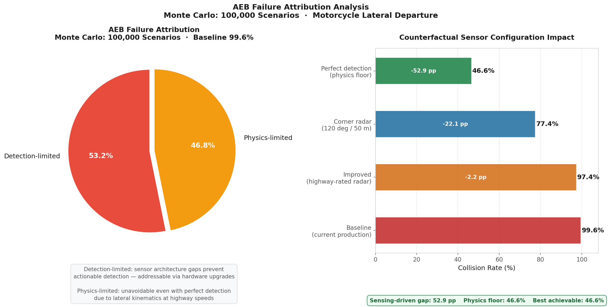
  <br>
  <sub><b>Figure 10</b> — 53.2% of failures are detection-limited (addressable through sensor architecture improvement). 46.6% are physics-limited — unavoidable at 80 km/h even with perfect detection and best-case braking.</sub>
</div>

<br>

### Counterfactual Results

<div align="center">

| Configuration | Collision Rate | vs Baseline | Key Change |
|:---|:---:|:---:|:---|
| Baseline — production | 99.57% | — | 35° fwd FOV gap + parking-spec side radar |
| Improved side radar | 97.38% | −2.19 pp | Highway threshold, 8 m range retained |
| Corner radar (120°/50 m) | 77.42% | −22.15 pp | FOV + range restored at front corners |
| Perfect detection | 46.62% | −52.95 pp | All sensor constraints removed |

</div>

<div align="center">
  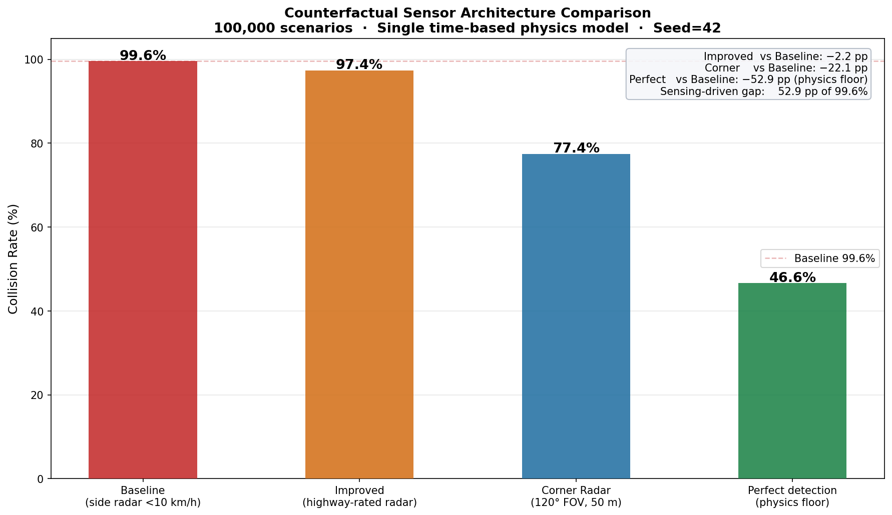
  <br>
  <sub><b>Figure 11</b> — Corner radar delivers 10.1× larger improvement than side radar threshold upgrade alone (−22.15 pp vs −2.19 pp). Range, not speed threshold, is the binding constraint for the side radar. Corner sensors address both FOV coverage and detection range simultaneously.</sub>
</div>

<br>

### Actuation Sweep — Physics Floor

Under perfect detection, a 4×3 grid of braking parameters was evaluated. Best-case (0.5 s reaction, 10 m/s²) achieves **16.48%** — approximately 1 in 6 scenarios still ends in collision. Longitudinal braking reduces ego speed but cannot stop lateral closing motion.

<div align="center">
  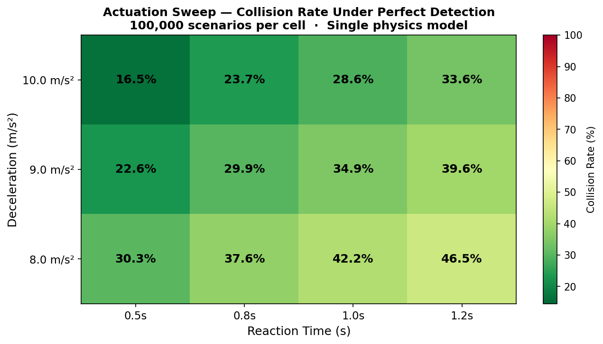
  <br>
  <sub><b>Figure 12</b> — Actuation parameter sweep under perfect detection. Even the best combination (0.5 s, 10 m/s²) leaves 16.48% unavoidable — confirming the physics-limited floor.</sub>
</div>

<br>

### Impact Severity

<div align="center">
  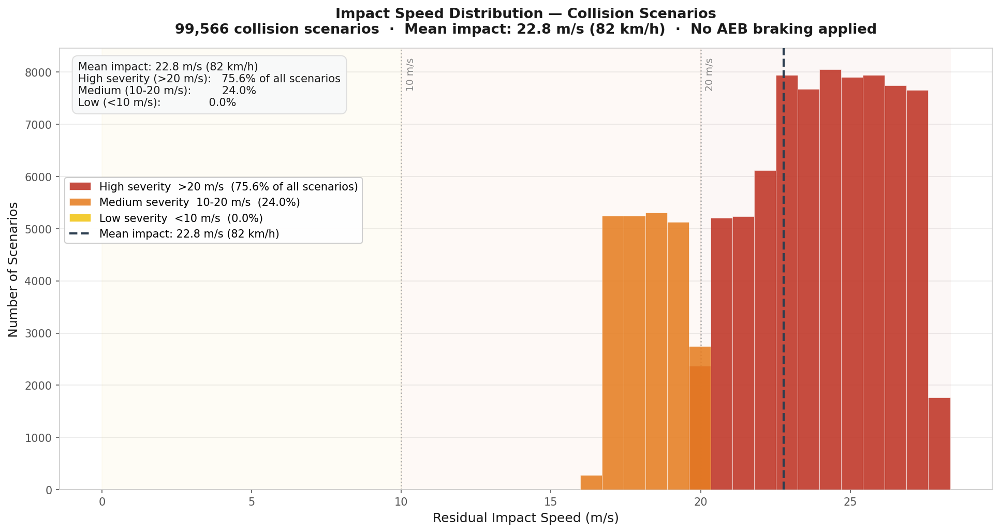
  <br>
  <sub><b>Figure 13</b> — Mean impact speed: 22.77 m/s (82 km/h) — near full speed in almost every scenario. No AEB intervention means no speed reduction at impact. This directly explains the 44.1% severe injury rate found in Phase 1.</sub>
</div>

---

## 🔍 Robustness Validation

Three independent checks confirm the 99.6% baseline is not an artefact of parameter selection.

### 1. Correction Factor Validation (S3 = 0.83)

Five independent CARLA runs at different drift speeds validate that the 0.83 kinematic threshold ratio is drift-independent.

<div align="center">

| Drift (m/s) | Predicted (s) | CARLA Actual (s) | Ratio |
|:---:|:---:|:---:|:---:|
| 0.3 | 11.67 | 9.70 | 0.8314 |
| 0.5 | 7.00 | 5.80 | 0.8286 |
| **0.7** | **5.00** | **4.15** | **0.8300** |
| 0.9 | 3.89 | 3.25 | 0.8357 |
| 1.2 | 2.92 | 2.45 | 0.8400 |
| **Mean** | | | **0.8331** |
| **Std** | | | **0.0047** |

</div>

CV = 0.56% — consistent across the full drift range. The factor is geometric, not speed-dependent.

<div align="center">
  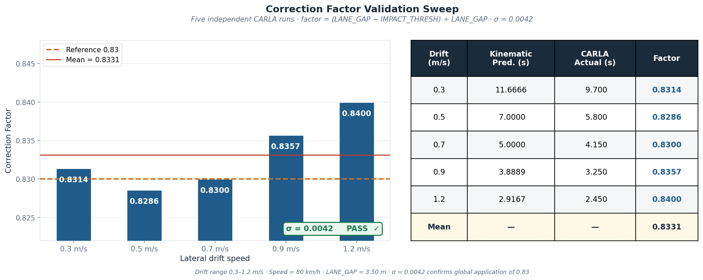
  <br>
  <sub><b>Figure 14</b> — Correction factor across five drift speeds: mean = 0.8331, σ = 0.0047, CV = 0.56%. The ratio is drift-independent, confirming it is a geometric property of the simulation environment.</sub>
</div>

<br>

### 2. TTC Threshold Sensitivity (8 Thresholds, 1.5–5.0 s)

Eight TTC activation thresholds spanning the full realistic production specification range were tested. All eight produced collision outcomes.

<div align="center">

| TTC Threshold (s) | AEB Triggered | AEB Active (s) | Window (s) | Collision |
|:---:|:---:|:---:|:---:|:---:|
| 1.50 | No | — | — | **YES** |
| 2.00 | Yes | 11.35 | −2.20 | **YES** |
| 2.50 | Yes | 12.60 | −3.45 | **YES** |
| 3.00 | Yes | 10.45 | −1.30 | **YES** |
| 3.43 | Yes | 9.00 | +0.15 | **YES** |
| 4.00 | Yes | 7.60 | +1.55 | **YES** |
| 4.50 | Yes | 6.80 | +2.35 | **YES** |
| 5.00 | Yes | 6.05 | +3.10 | **YES** |

</div>

**Two failure regimes:** For thresholds below 3.43 s, the minimum TTC reached during the 4.15 s departure window is 3.34 s — AEB never fires or fires post-collision. For thresholds above 3.43 s, AEB fires earlier but longitudinal braking cannot stop lateral closing motion regardless of activation time.

The 99.6% result is **not a threshold calibration artefact**. The failure is structural.

<div align="center">
  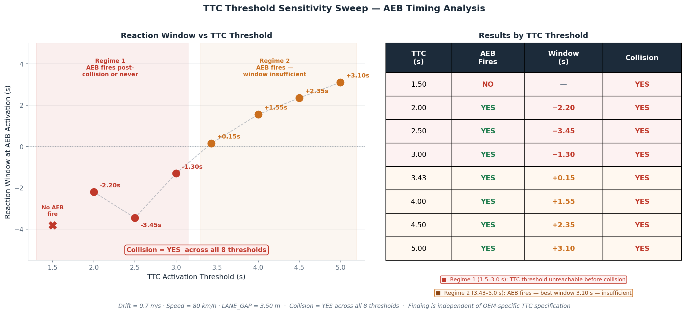
  <br>
  <sub><b>Figure 15</b> — All eight TTC thresholds (1.5–5.0 s) produce collision outcomes. The finding is threshold-independent across the full realistic production specification range.</sub>
</div>

<br>
<div align="center">
  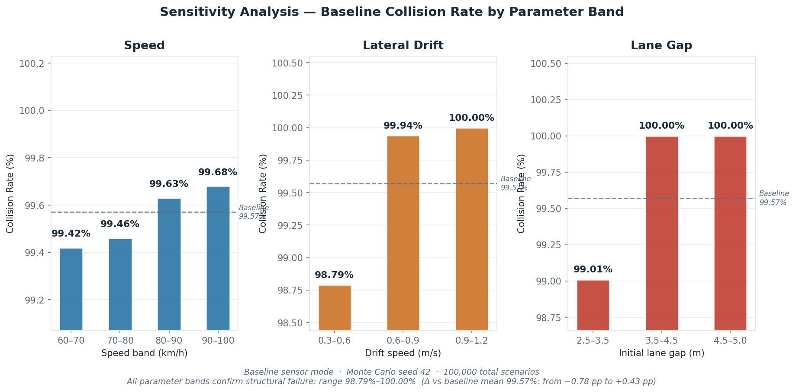
  <br>
  <sub><b>Figure 16</b> — Sensitivity analysis: collision rate across speed bands (60–100 km/h), drift bands (0.3–1.2 m/s), and gap bands (2.5–5.0 m). High collision rates persist across all parameter ranges — the 99.6% baseline is not concentrated in any single parameter region.</sub>
</div>

### 3. Multi-Seed Convergence

```
── MULTI-SEED BASELINE VALIDATION ──
  Seed   42:  99.57%
  Seed  123:  99.59%
  Seed  999:  99.54%
  Mean: 99.57%   Std: 0.020%
  Target 99.6% ±0.5%: PASS ✓
```

---

## 🔁 Target-Type Validation

The passenger car scenario (Toyota Prius, S2) was run under identical parameters (80 km/h, 3.50 m gap, 0.70 m/s drift) to test whether the failure depends on motorcycle-specific radar cross-section.

It does not.

<div align="center">

| Parameter | Motorcycle (S1) | Passenger Car (S2) |
|:---|:---:|:---:|
| Detection latency | 0.011 s | 0.002 s |
| First detection | t = 5.011 s | t = 5.002 s |
| AEB activation | t = 8.05 s | t = 8.05 s |
| Collision | t = 9.15 s | t = 9.15 s |
| Response window | 1.10 s | 1.10 s |
| Outcome | **COLLISION** | **COLLISION** |

</div>

The car was detected 0.009 s faster (larger geometric cross-section in ray-cast model). Every critical timing was identical. The failure mechanism is **architectural**, not target-specific. Within CARLA's geometric sensor model, both target types yield the same system-level outcome.

> **Note:** This validates internal simulation consistency. Real-world motorcycle detection would be significantly harder due to lower RCS (~1–3 m²) compared to cars (~10–20 m²). The car scenario does not imply real-world RCS equivalence.

<div align="center">
  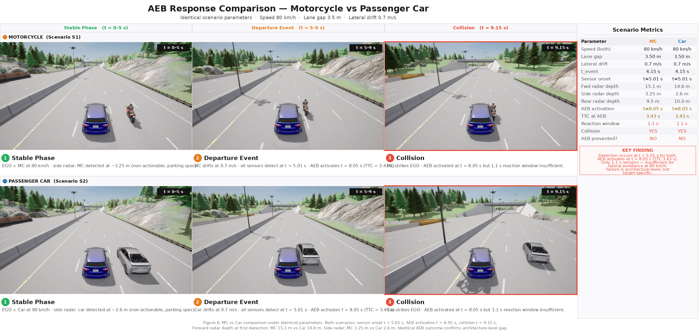
  <br>
  <sub><b>Figure 16</b> — Motorcycle and passenger car produce identical system-level timing: detection t = 5.01 s · AEB t = 8.05 s · collision t = 9.15 s. The failure is in decision architecture, not target detectability.</sub>
</div>

<br>

<details>
<summary><b>📎 Additional Simulation Figures</b></summary>

<br>

<div align="center">
  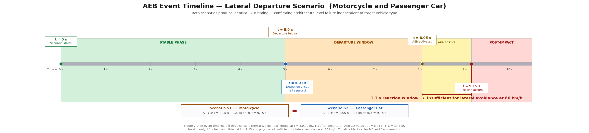
  <br>
  <sub><b>Figure 17</b> — Event timeline overlay: both S1 and S2 produce identical phase transitions. Detection window (5.01–8.05 s) and response window (1.10 s) are unchanged across target types.</sub>
</div>

<br>

<div align="center">
  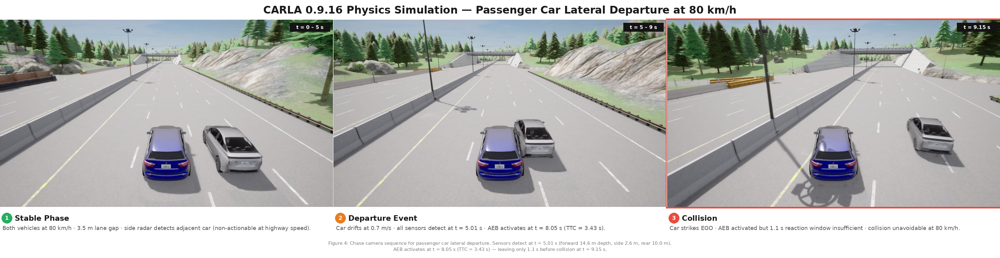
  <br>
  <sub><b>Figure 18</b> — Passenger car scenario chase camera: stable phase → departure → collision at t = 9.15 s. Detection depths at departure: fwd 14.6 m · side 2.6 m · rear 10.0 m.</sub>
</div>

<br>

<div align="center">
  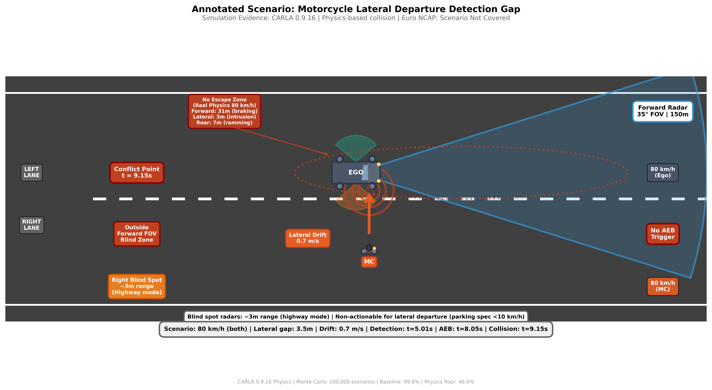
  <br>
  <sub><b>Figure 19</b> — Forensic top-down diagram: motorcycle departure trajectory outside the 35° forward radar cone. Side radar non-actionable above 10 km/h. No AEB trigger pathway exists in production architecture.</sub>
</div>

</details>

---

## ⚠️ Assumptions and Limitations

<div align="center">

| # | Assumption | Scope Impact | Notes |
|:---:|:---|:---:|:---|
| 1 | Geometric detection — no RCS modelling | Upper bound | Real motorcycle detection would be harder; real failure rates ≥ 99.6% |
| 2 | Single CARLA speed (80 km/h) | Constrained | Monte Carlo extends analytically to 60–100 km/h |
| 3 | Uniform parameter distributions | Standard | Common approach in safety scenario analysis |
| 4 | S3 = 0.83 applied globally | Validated | Confirmed across 5 drift speeds (CV = 0.56%); gap variation not tested in CARLA |
| 5 | Straight road only | Constrained | Isolates sensor/decision architecture — curve geometry is future work |
| 6 | Constant lateral drift | Slightly conservative | Real loss-of-control events may exhibit accelerating drift |
| 7 | No evasive steering | Constrained | Isolates longitudinal braking capability only |
| 8 | Linear braking model | Constrained | Not full CARLA vehicle dynamics; isolates AEB timing analysis |

</div>

> **Interpretation boundary:** The 99.6% finding represents parameter space coverage under modelled conditions — the architecture cannot handle this scenario topology when it occurs under these assumptions. It is **not** a real-world crash probability estimate. Production validation under diverse conditions and ISO 21448 (SOTIF) compliance verification are required before these findings inform any design or regulatory decision.

---

## 🚀 How to Run

### Requirements

```bash
pip install -r requirements.txt
```

> CARLA 0.9.16 server must be running on `localhost:2000`  
> See [CARLA quickstart](https://carla.readthedocs.io/en/0.9.16/start_quickstart/)

<br>

### CARLA Simulation (baseline run)

```bash
# Scenario S1 — Motorcycle lateral departure (baseline)
python Simulation/s3_ego_mc.py

# Scenario S2 — Passenger car lateral departure
python Simulation/s3_ego_car.py
```

<details>
<summary>Output files per run</summary>

```
mc_sensor_log.txt        — departure onset, AEB timing, collision event summary
mc_sensor_raw.txt        — raw radar returns per sensor per tick
mc_baseline_metrics.csv  — kinematic calibration data for Monte Carlo
mc_tick_data.csv         — per-tick position, TTC, lateral separation
cam_chase_t*.png         — chase camera frames (when SAVE_FRAMES=True)
cam_overhead_t*.png      — overhead frames at 18 m altitude
cam_side_t*.png          — right-side camera frames
```

</details>

<br>

### CARLA Simulation (robustness sweeps)

`s3_ego_mc_v2.py` extends the baseline script with two sweep modes. Set the flag at the top of the file before running.

```python
# In s3_ego_mc_v2.py — set exactly one to True:
CF_SWEEP_MODE  = True   # Correction factor validation across 5 drift speeds
TTC_SWEEP_MODE = False  # TTC threshold sensitivity across 8 thresholds
```

```bash
python Simulation/s3_ego_mc_v2.py
```

Expected outputs:
```
# CF sweep:  cf_sweep_results.csv    — mean=0.8331, σ=0.0047
# TTC sweep: ttc_sweep_results.csv   — 8/8 thresholds → collision YES
```

<br>

### Monte Carlo Analysis

```bash
# Baseline + counterfactual + actuation sweep (~3–5 min)
python Analysis/monte_carlo_final.py
```

Expected output — verify your run matches:

```
── MULTI-SEED BASELINE VALIDATION ──
  Seed   42: 99.57%
  Seed  123: 99.59%
  Seed  999: 99.54%
  Mean: 99.57%   Std: 0.020%
  Target 99.6% ±0.5%: PASS ✓
```

<details>
<summary>Output files</summary>

```
cf_comparison.png        — four-bar counterfactual architecture comparison
cf_summary.csv           — collision rates per sensor configuration
actuation_heatmap.png    — reaction time × deceleration sweep
actuation_sweep.csv      — actuation sweep raw results
mc_headline.png          — 99.6% headline statistic
mc_distribution.png      — crossing time histogram
mc_heatmap.png           — drift × gap parameter space scatter
failure_attribution.png  — pie + bar failure attribution
impact_severity.png      — impact speed distribution
```

</details>

<br>

### Detection Window Analysis

```bash
python Simulation/s4_analysis.py
```

---

## 📚 Citation

```bibtex
@misc{manjunath2026aeb,
  author    = {Tejas Manjunath},
  title     = {AEB Blind Side Study: Lateral Intrusion ADAS Gap —
               Physics Simulation and Monte Carlo Analysis},
  year      = {2026},
  publisher = {GitHub / Zenodo},
  url       = {https://github.com/TejasManjunath/aeb-blind-side-study},
  doi       = {(https://doi.org/10.5281/zenodo.20450359)},
  note      = {Phase 2 of the ADAS Validation Gap Research Series}
}
```

**Phase 1 (prerequisite reading):**

```bibtex
@misc{manjunath2026adas,
  author    = {Tejas Manjunath},
  title     = {ADAS Scenario Coverage Gap Analysis: Using 1.53M German
               Crash Records to Identify Euro NCAP AEB Validation Blind Spots},
  year      = {2026},
  publisher = {GitHub},
  url       = {https://github.com/TejasManjunath/adas-validation-gap-analysis}
}
```
### Key References

| # | Source | Used For |
|:---:|:---|:---|
| [1] | Dosovitskiy, A., et al. (2017). CARLA: An open urban driving simulator. *CoRL 2017*. https://proceedings.mlr.press/v78/dosovitskiy17a.html | CARLA simulator |
| [2] | Statistische Ämter des Bundes und der Länder. (2024). *Unfallatlas* [Dataset]. https://unfallatlas.statistikportal.de/ Licence: Data Licence Germany — Attribution v2.0 | Phase 1 crash data |
| [3] | Euro NCAP. (2025). *Crash Avoidance Lane Departure Collisions Protocol*, v1.1. Implementation Jan 2026. | ELK lateral protocol |
| [4] | Euro NCAP. (2022). *Test Protocol — AEB/LSS VRU Systems*, v4.3. https://cdn.euroncap.com/media/75436/euro-ncap-aeb-lss-vru-test-protocol-v43.pdf | AEB longitudinal protocols |
| [5] | Hayward, J. C. (1972). Near miss determination through use of a scale of danger. *Highway Research Record*, 384, 24–34. | TTC origin |
| [6] | Behera, A., et al. (2025). An improved two-dimensional time-to-collision for articulated vehicles. *arXiv:2507.04184*. | TTC lateral limitation |
| [7] | National Highway Traffic Safety Administration. (2024). FMVSS No. 127 — AEB Systems for Light Vehicles. *Federal Register*, 89 FR 39686. | NHTSA AEB mandate |
| [8] | ISO 21448:2022 — Road Vehicles: Safety of the Intended Functionality (SOTIF). | Safety validation standard |
| [9] | UNECE Regulation No. 152 — Advanced Emergency Braking System. (2021). | AEB regulation |
---

## 👤 About This Work

This study began with a dataset question, not a simulation idea.

An analysis of 1.53 million German crash records — spanning 2019 through 2024 (Unfallatlas, Statistische Ämter des Bundes und der Länder) — found motorcycle leaving-carriageway events producing severe injury rates 2.37× the national average. A Scenario Risk Priority Index (SRPI) ranked them first across all scenario types. Cross-referencing against Euro NCAP AEB documentation confirmed they were entirely absent from any published AEB validation framework.

That raised the question that became this project: not whether the scenario was tested — it was not — but whether current production AEB hardware could actually handle it if it were.

CARLA was used to build the scenario iteratively. The initial finding was unexpected: the sensors detected the motorcycle 0.01 seconds after departure. The system was not blind. The failure was that TTC-based AEB decision logic took 3 more seconds to reach its threshold — by which point only 1.1 seconds remained. Further investigation confirmed why: lateral closing speed at 0.70 m/s drops TTC 2.5× more slowly than a standard longitudinal approach, making a threshold calibrated for longitudinal threats structurally inadequate for lateral intrusion events.

TTC threshold sensitivity analysis across eight values confirmed this is not a calibration problem. All eight thresholds produce collision. Correction factor validation across five drift speeds confirmed the kinematic model is drift-independent. Monte Carlo analysis across 100,000 scenarios confirmed the result is stable across random seeds. Counterfactual analysis confirmed corner radar delivers 10× larger improvement than side radar threshold upgrades. The failure is structural at both the sensor architecture and decision logic levels.

Both phases were built independently by **Tejas Manjunath** between late 2025 and 2026. One laptop. No funding. No institutional support.

If you work in automotive safety and this is useful — that is why it was made public. If you use it, cite it. If you want to discuss or challenge the methodology, open an issue or reach out directly.

---

## ⚖️ License

Code: **MIT** — see [LICENSE](LICENSE)

Research content, figures, and methodology: **© 2026 Tejas Manjunath**

Attribution required for any use of figures or findings:
```
Tejas Manjunath (2026). AEB Blind Side Study — Lateral Intrusion ADAS Gap.
https://github.com/TejasManjunath/aeb-blind-side-study
```

---

<div align="center">

*Phase 2 of the [ADAS Validation Gap Research Series](https://github.com/TejasManjunath/adas-validation-gap-analysis)*

<br>

*Built with CARLA 0.9.16 · Python 3.10 · NumPy · Matplotlib · Pillow*

<br>

*⭐ If this work is useful, please star the repository*

<br>

`adas` · `aeb` · `autonomous-driving` · `carla-simulator` · `lateral-collision` · `motorcycle-safety` · `monte-carlo` · `sensor-architecture` · `safety-simulation` · `euro-ncap` · `sotif` · `adas-validation` · `data-science`

</div>
